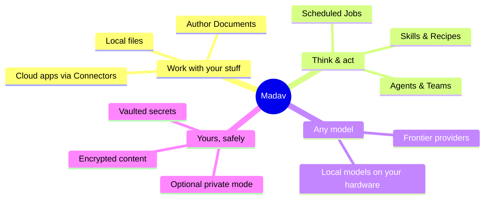
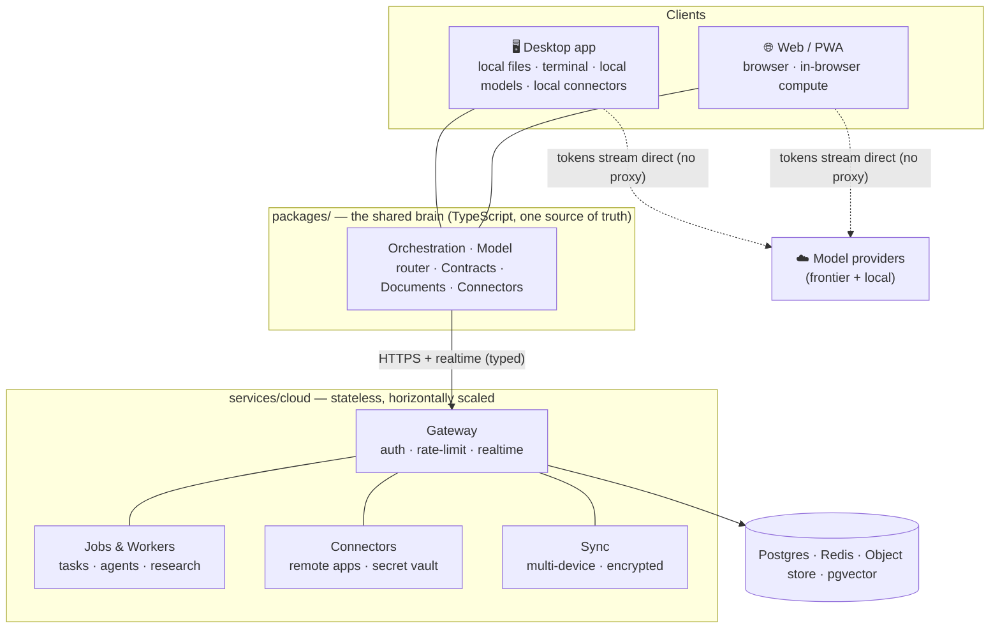
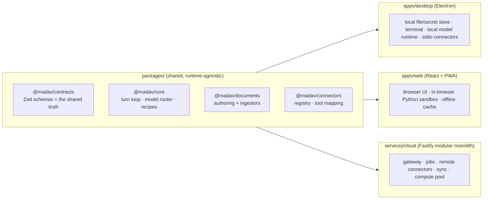
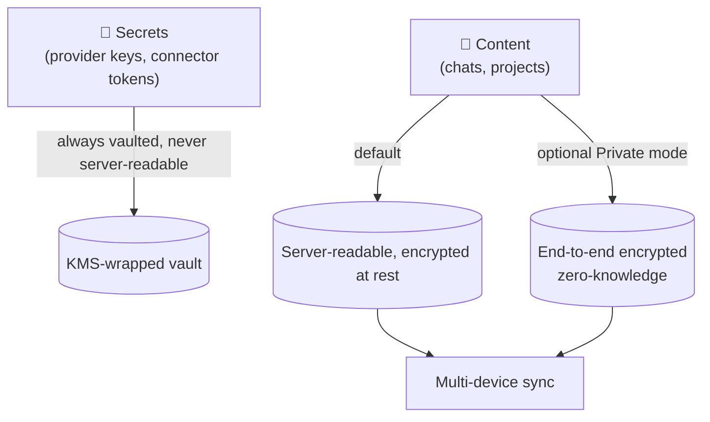
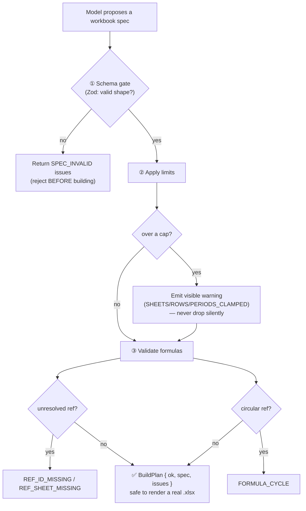
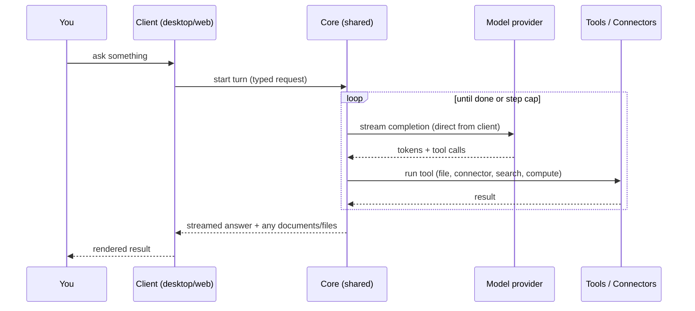
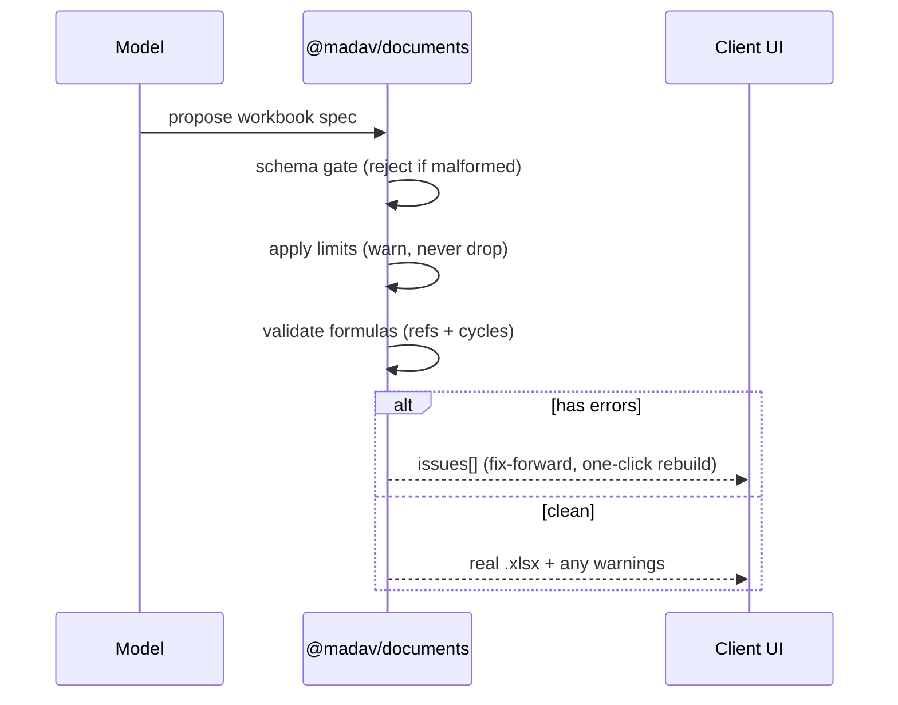
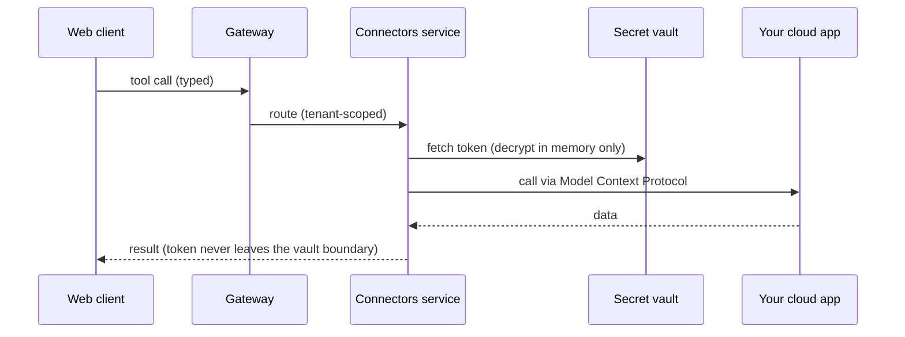
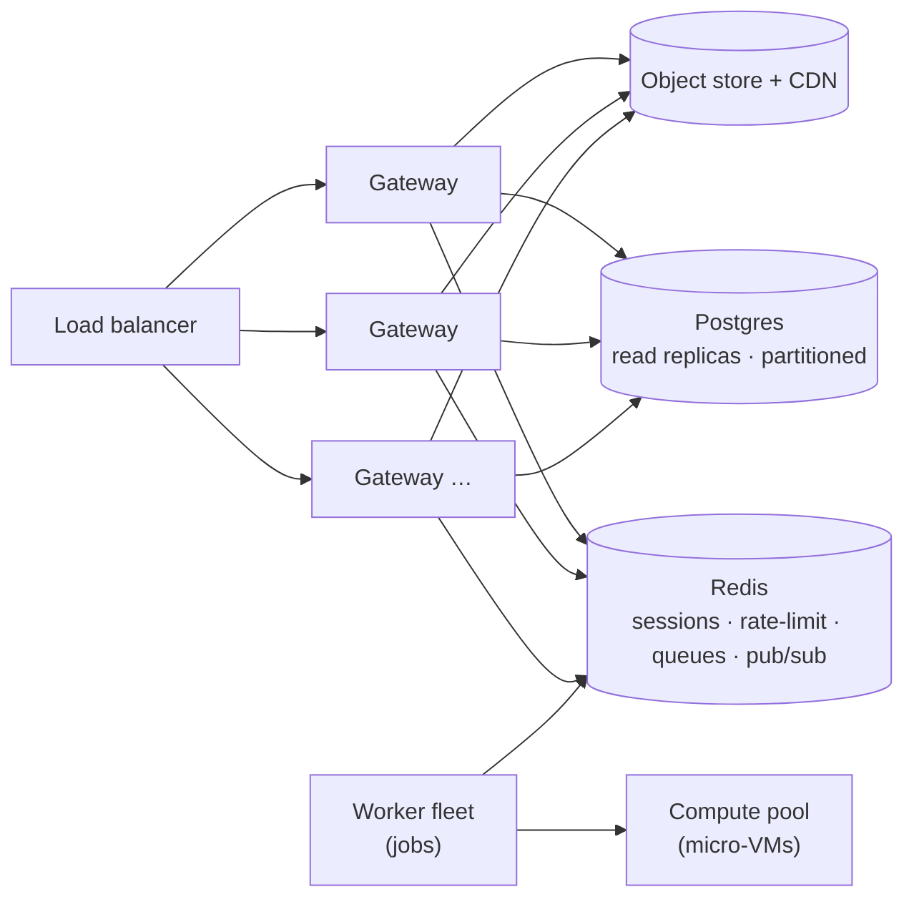
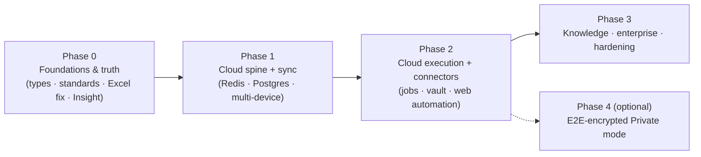

# The Madav Blueprint

> **One product. Three runtimes. One brain.**
> A privacy‑respecting AI workspace that lets people work with their **local files and many cloud apps**, **author real documents**, and **automate work with agents** — on desktop, on the web, and in the cloud — using a choice of frontier and local models.

**Audience:** anyone — a new engineer, a designer, or the owner. It reads top‑to‑bottom in plain English; the diagrams carry the structure. Deep rules live in `MADAV.md`; this document is the *why* and the *shape*.

**Status:** living document. It grows with every build. This edition documents the target architecture and the foundation that exists today (see `REBUILD-STATE.md` for what is built vs. planned).

---

## 1. What Madav is (in one minute)

Most AI apps are a chat box bolted onto someone else's model. Madav is different in three ways:

1. **It does the work, not just the talking.** Madav *authors* real spreadsheets, documents, slides and PDFs, and *runs* multi‑step jobs (research, agents, scheduled automations) — deterministically, with real libraries and real sandboxes, never by hoping a model writes correct code.
2. **It meets you where your work lives.** Your local files *and* your cloud apps (through connectors), on a real desktop app *and* on the web, from **one shared brain** so both behave identically.
3. **It respects your data.** Your secrets (keys, tokens) never leave your control. Your content is yours, with an optional fully‑private (end‑to‑end‑encrypted) mode.



---

## 2. The big picture

Madav is **one TypeScript brain** (`packages/`) that runs in **three places**: the desktop app, the web app, and the cloud. Each place adds only what it alone can do. The cloud never carries your model‑inference cost — your tokens stream straight from your chosen provider to your client.



**Why this shape wins:** build a capability once in the brain, get it on all three runtimes. Keep inference at the edge, and the cloud bill stays small even at a million users.

---

## 3. The three runtimes, one core



The only things allowed to differ per runtime are genuine platform mechanics — a terminal, local storage, the local model runtime. Everything else is shared, by rule (`MADAV.md` → "one source of truth").

---

## 4. The principles every part obeys

| # | Principle | What it means in practice |
|---|---|---|
| 1 | **One source of truth** | Each behaviour lives once, in the brain; runtimes inherit it. Never two copies. |
| 2 | **One language: TypeScript** | Client and server share the *same* schema objects — no drift. Python only inside sandboxes. |
| 3 | **Deterministic I/O, sandboxed code** | Real libraries read/write files; model‑written code runs only in isolation; specs are schema‑validated *before* use. |
| 4 | **Privacy tiers** | Secrets always vaulted; content server‑readable + encrypted by default; optional end‑to‑end private mode. |
| 5 | **Built by & for Madav** | No competitor/identity branding in code; real integrations isolated in a provider layer. |
| 6 | **Robustness over stopgaps** | A logged failure beats a silent `catch`. Never drop user data silently — warn. |
| 7 | **Tests are part of done** | Every shared module ships with tests; coverage only grows. |
| 8 | **Efficient for a small team** | Modular monolith first; add complexity only when load demands it. |

---

## 5. Subsystem tour

### 5.1 The Core — the turn loop & model router
The Core runs one conversational/agentic turn: assemble context → call the model → parse tool calls → run tools → emit events → repeat to a step cap. It routes across **many model providers** (frontier and local) with automatic fallback and cooldown, so a user is never locked to one vendor and a transient outage degrades gracefully.

### 5.2 Models & providers (including local)
Madav treats every model as a provider behind one interface. **Local models** are first‑class: on the desktop, Madav detects/installs a local runtime and lets you **pull, create, and manage** models that run on *your* hardware; the "model builder" is simply a Madav **Agent** pinned to a local base. On the web, Madav connects to your local endpoint or runs small in‑browser models.

### 5.3 Connectors — local + cloud, one model
Connectors speak the open **Model Context Protocol**. Local connectors (your apps, your files, a terminal) run on the desktop. Cloud connectors (your SaaS apps) run server‑side with a per‑user **encrypted token vault**. The registry and tool‑mapping are shared, so both behave identically.

### 5.4 Documents — authoring + ingestors
This is Madav's signature. Two deterministic halves:

- **Authoring:** the model proposes a *structured spec*; Madav's own code turns it into a real `.xlsx/.docx/.pptx/.pdf`. The model never writes the file.
- **Ingestors:** real libraries read your uploaded files into a typed preview; the model never writes the parser.

The Excel engine (already built — see §6) is the proof: schema‑gated, never silently truncating, formula‑validated *before* you open the file.

### 5.5 Compute — real sandboxes
When code must run, it runs in a real sandbox: in‑browser Python on the web, a bundled runtime on desktop, and a server micro‑VM pool for heavy work. No model‑written code ever runs in a privileged context.

### 5.6 Jobs & automation
Scheduled tasks, agents, teams and research run as **durable jobs** in the cloud — the *same* Core logic as interactive chat, just headless and retried. Web users get automation without keeping a desktop open.

### 5.7 Knowledge (optional)
A modular retrieval layer over your Projects: deterministic ingestion → embeddings → hybrid search in one vector store. A feature, not the identity.

### 5.8 Storage & privacy tiers

One storage path, a *custody policy* per workspace (`server‑readable` | `e2ee‑private` | `device‑only`). The codebase never forks.

### 5.9 Observability ("Insight")
Every service emits traces, metrics and logs, plus Madav‑specific signals (document truncation/repair events, sandbox fallbacks, job durations). You manage a million users by *seeing* them.

---

## 6. Deep dive: the Excel‑stability engine (built today)

The old failure mode was: the model writes spreadsheet code/spec, and we build it optimistically — so files silently dropped data, formulas broke on open, and malformed specs slipped through. The new engine makes that impossible.



It lives in `packages/documents/` and is fully type‑checked (strict) and unit‑tested with Node's built‑in runner:

```
✓ accepts a valid spec with no errors
✓ rejects a malformed spec BEFORE building (schema gate)
✓ warns (never silently drops) when sheets exceed the cap
✓ flags an unresolved formula reference
✓ detects a circular formula reference
✓ treats prior‑period [id@-1] as a recurrence, not a cycle
6 pass / 0 fail
```

This is the pattern every document type will follow: **validate → warn, don't drop → verify before the user sees it.**

---
## 7. Key flows

### 7.1 A chat/agent turn


### 7.2 Authoring an Excel workbook (the stability path)


### 7.3 A cloud connector call (web user, no desktop)


---

## 8. Data model (essentials)
```mermaid
erDiagram
  USER ||--o{ WORKSPACE : owns
  WORKSPACE ||--o{ PROJECT : contains
  WORKSPACE ||--o{ CONNECTOR_GRANT : has
  PROJECT ||--o{ CHAT : contains
  CHAT ||--o{ MESSAGE : has
  WORKSPACE ||--o{ JOB : schedules
  JOB ||--o{ JOB_RUN : produces
  USER {
    id pk
    email
    created_at
  }
  WORKSPACE {
    id pk
    name
    custody "server-readable | e2ee-private | device-only"
  }
  CONNECTOR_GRANT {
    id pk
    provider
    token_ref "KMS-wrapped; never plaintext"
  }
  JOB {
    id pk
    kind "task | agent | team | research"
    schedule
  }
```
Secrets are referenced, never stored in the clear. Content rows carry a `custody` policy that decides whether the server can read them.

---

## 9. Security & the privacy promise

| Asset / surface | Threat | Control |
|---|---|---|
| Secret/token vault | Theft, lateral access | KMS‑wrapped keys, in‑memory‑only decryption, least privilege, per‑tenant isolation, audit |
| Sandbox (client + cloud) | Escape, resource abuse | WASM isolation in‑browser; micro‑VM server‑side; CPU/mem/time quotas; no ambient credentials |
| Synced content (default) | DB/server compromise | Encryption at rest, strict access control, tenant isolation, audit, retention policy |
| Private mode (optional) | Server reading content | End‑to‑end encryption; server holds ciphertext only (zero‑knowledge) |
| Model‑written code | Injection into a privileged context | Never `eval` in privilege; all generated code is sandboxed |
| Inference keys & tokens | Exfiltration | Client‑direct by default; vaulted if synced; never logged |

**The promise, plainly:** *your keys are always yours; your content is encrypted, and a fully private end‑to‑end mode is one switch away.*

---

## 10. Built to scale to 1,000,000 users

The structural advantage: **Madav never proxies your model inference** — tokens go client → provider. So the cloud carries only coordination, sync, connectors, jobs and search: cheap, bursty, cacheable work.



| Tier | Scales by | Guardrail |
|---|---|---|
| Gateway/API | stateless replicas | Redis sessions/limits; autoscale on RPS |
| Realtime | replicas + Redis pub/sub | shard by tenant |
| Jobs/Workers | add workers | priority queues; per‑class concurrency |
| Compute | micro‑VM pool | quotas; in‑browser first |
| Postgres | read replicas + partitioning | expand‑contract migrations |

SLO targets: API p99 < 300 ms (excludes model streaming), first‑token < 1.5 s p95, zero cross‑tenant exposure (hard invariant).

---

## 11. The plan, in phases



Phases 0→1→2 are the spine, in order. Knowledge/enterprise and the private‑encryption mode are demand‑driven and never block the spine. **Today we are inside Phase 0** — the foundation is being laid (see `REBUILD-STATE.md`).

---

## 12. Repository map (clean by construction)
```
packages/      Shared TypeScript brain
  contracts/     Zod schemas — the shared truth
  documents/     Deterministic authoring + ingestors (Excel engine lives here, tested)
  …              core, connectors, models — added as migrated
apps/
  desktop/       Electron thick client (local powers)
  web/           React + PWA
services/
  cloud/         Stateless API: gateway · jobs · connectors · sync · compute
scripts/         Repo tooling (branding scanner, checks)
docs/
  blueprint/     This document
  branding/      The "built for Madav" policy + reference report
  _legacy/       Archived old docs (safe to delete after review)
```
Legacy folders (`core/`, `src/`, `electron/`, `server/`) remain only until their logic migrates into the structure above, then they go. Nothing unused is kept; nothing is deleted before its replacement is proven.

---

## 13. Glossary (Madav's words)

| Term | Meaning |
|---|---|
| **Workroom / Team** | A space where one or more **Agents** collaborate on your behalf |
| **Agent / Persona** | A configured worker: a model + instructions + tools + identity (also the local‑model "builder") |
| **Skill** | A reusable, plain‑language playbook an agent can follow |
| **Recipe** | A proven, replayable script for a repeated job (keeps weak models reliable) |
| **Connector** | A link to one of your apps via the open Model Context Protocol |
| **Ingestor** | A deterministic reader that turns an uploaded file into typed data |
| **Compute** | A real sandbox where code runs safely |
| **Knowledge** | Optional retrieval over a Project's files |
| **Insight** | Madav's observability (traces, metrics, product signals) |
| **Custody** | The privacy policy on a workspace's content (server‑readable / private / device‑only) |

---

## 14. References & related documents
- `MADAV.md` — the engineering charter (the rules).
- `REBUILD-STATE.md` — exactly what is built vs. planned, and how to run & compare.
- `docs/branding/` — the "built for Madav" policy and the live reference report.
- `packages/documents/` — the working, tested Excel‑stability engine.

> *This blueprint is a living document. Each build sharpens it — more diagrams, more depth, more of the system rendered in plain English.*
